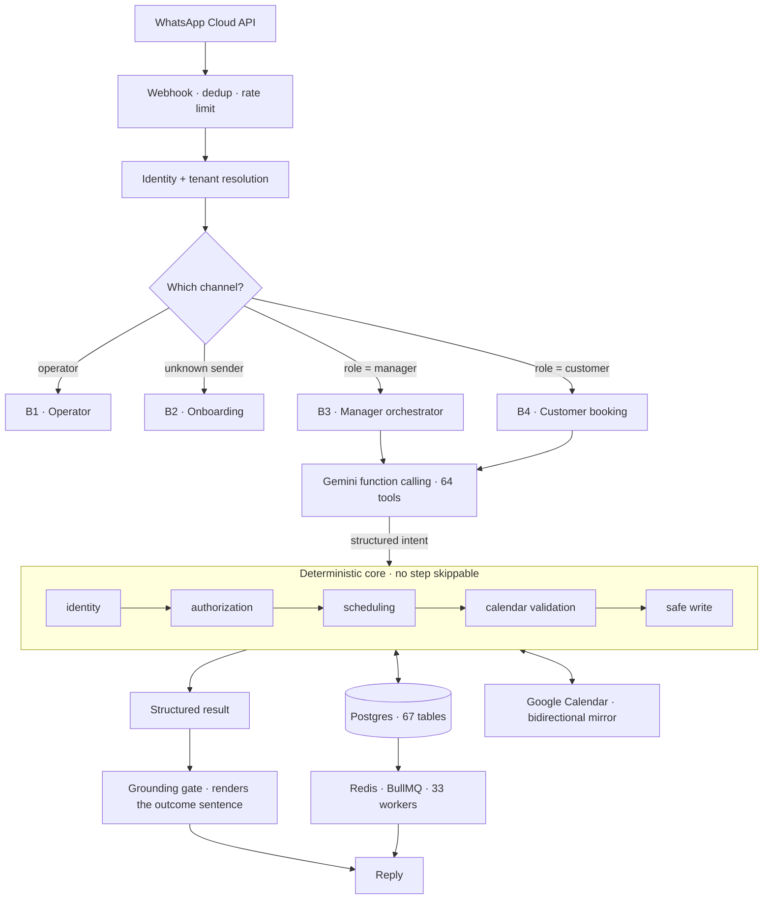

# MiddleMan

**A WhatsApp-native assistant that runs a local business's calendar — and is architecturally prevented from lying about it.**

Every business gets one dedicated WhatsApp number. Customers book, reschedule and ask questions there; the owner runs the business from the same place, in plain language. No app to install, no dashboard to learn, no new habit to form — for either side.

Live in production on Google Cloud Run (`europe-west3`), serving real businesses on real WhatsApp numbers. `v1.0.243`, 2,040 commits since April 2026.

> **This page is the write-up; the code is in a private repository.** Why, and how to get access, is at the bottom.

---

## The problem this is built around

Booking is an unforgiving domain for a language model. A double-booked slot, a session moved to the wrong hour, or the sentence *"you're all set for Tuesday at 6"* when nothing was ever written — each is a real customer standing at a locked door. The failure isn't embarrassing, it's material.

But the model is also the entire interface. There is no form to fall back on, no dropdown that constrains input to something valid. Someone types *"can we push my Tuesday to later in the week, and does my sister need her own booking?"* and the system has to be right.

The naive shape — let the model call a tool, then let it tell the customer what happened — fails in a specific, recurring way: the model writes a confident outcome sentence that describes what it *intended*, not what the system actually did. The write silently failed, the slot was taken, the policy declined it. The reply says "confirmed" anyway.

**A validator on the reply text does not fix this.** That was the first instinct here and it was wrong: a checker that inspects model output for false claims is an arms race against a system that generates novel phrasings forever, and every gap is a lie shipped to a customer. The architecture below exists because that approach was tried and abandoned.

---

## The architectural answer

Four constraints, enforced in code rather than in prompts:

**1. The LLM is interpretive only.** It extracts intent and emits structured output. It never mutates state. Nothing it produces reaches the database without passing through the deterministic core.

**2. Every state change runs one pipeline, in order.**

```
identity → authorization → scheduling logic → calendar validation → safe write
```

No caller may skip a step. Availability is computed by the engine, never by the model. A failed write is never reported as a success; partial state is rolled back or explicitly flagged.

**3. Outcome sentences are rendered, not written.** This is the load-bearing one, so here is the actual mechanism rather than the claim.

The executor that did the work emits an `Outcome` record — never the model, never a prompt. It carries a completeness dimension (`written` / `missing` / `assumed`), because a write is often partial by design: create a customer from a name alone and the service duration comes from a column default the owner never gave. Without `assumed`, a correct-looking confirmation would report a value nobody supplied.

The model is then asked for a reply in three parts:

```
{ prose_before?, outcome_ref?, prose_after? }
```

It decides **whether** to mention the outcome and **where** the sentence sits. **The system supplies the words.** `outcome_ref` can be a list, because one turn can book some occurrences, hold others, waitlist a third and skip a fourth — no single fixed sentence expresses that, and the model shouldn't be inventing one.

The result is that "you're confirmed for Tuesday at 18:00" is not a sentence the model is capable of composing. It can only point at an outcome the core actually produced. **The false claim is unwritable, rather than detected after the fact.**

See `src/domain/grounding/` and `docs/standards/ACTION_GROUNDING_SPEC.md`.

**4. Static facts go in the prompt; volatile state comes from tools, always fresh.** Services, hours, prices and policies are cheap and cached. Bookings, capacity and calendar state change between prompt assembly and the model's answer, so they are never answered from a snapshot.

A corollary that took a production incident to learn: **the internal record is the source of truth, always.** Google Calendar is a bidirectional mirror — the assistant writes through to it, and owner-made edits in Google are ingested as input events and reconciled back. Treating Google as authoritative had put an external system in charge of the business's own booking record.

---

## How a message flows



Every inbound message routes into **exactly one of four channels**, and any work on conversational behaviour must name which one it targets:

| | Channel | Who's talking | Design stance |
|---|---|---|---|
| **B1** | Operator | me, running the platform | Full multi-turn reasoning over the transcript, plus cross-session memory |
| **B2** | Onboarding | a business owner who isn't set up yet | Never parses a question as an answer; explains in plain language when confusion shows |
| **B3** | Manager | a verified owner | Gemini native function calling over 64 tools — calendar, CRM, payments, memberships, broadcasts, site generation |
| **B4** | Customer | anyone booking | Two layers: transactional replies are *phrased* by the model from a sanitised situation string; conversational ones reason freely over business facts |

Web and app surfaces mirror these channels rather than forking the logic — how far that goes depends on which of the three products a business is on.

---

## Three products, one engine

Not every business wants the PA to own its calendar. The difference is a column (`businesses.pa_product`) and a gate — never a fork of the codebase.

**1. Booking — the full product.** The PA owns the calendar end-to-end: availability, holds, bookings, reschedules, waitlists, memberships and payments all live in the internal record, with Google Calendar as the mirror. These businesses also get **web surfaces that mirror the PA rather than reimplement it** — an owner PWA (`/app`: calendar, bookings, memberships, payments, config, conversations) and a per-tenant customer web app. The owner app is Branch 3 with a different skin over the identical engine, so a capability added to the manager orchestrator appears in the app without being built twice. That coherence is the point: there is no second definition of what a booking is.

**2. External registration — businesses already on another platform.** Studios and gyms running something like Arbox already have a booking system nobody intends to replace. Here the PA runs the conversation — answering, qualifying, explaining the schedule — and the booking engine is *explicitly forbidden from writing*: `isExternalRegistrationOnly` gates the service, the engine refuses the write with `external_registration_required`, and the PA relays the operator's registration URL, reproduced verbatim from a grounded fact rather than paraphrased into prose. It is double-gated — a business-level flag plus a per-service URL, both inert by default — so the exception can never become an accidental default. **Today this is a hand-off, not an API-level write into the operator's system.** Integrating at the API level is the natural next step, and the refusal gate is precisely what makes it a safe one: the path that must not silently half-book is already closed.

**3. Conversational — larger organisations, where we deliberately do not book.** Theatres, cultural institutions and similar bodies have large catalogues, high question volume, and ticketing they will not migrate. `pa_product = 'conversational'` routes the turn to a separate flow that answers from a curated knowledge base and never reaches the booking engine at all. The interesting constraint is that it has no calendar to be grounded against, so grounding shifts entirely to the facts block — and notably, **no URL ever enters through the situation string**, only as a grounded fact reproduced verbatim, because a link asserted in prose is a link the model can quietly paraphrase into a wrong one.

One engine, three postures. What changes between them is not the logic but **what the PA is permitted to do** — and in two of the three, the most important thing it does is refuse.

---

## Engineering practices worth a look

These are the parts I'd point a reviewer at first.

**A test tier for defects that are still broken.** `tests/refuted/` holds one executable test per known-open bug, each expected to be **red**. CI asserts they *stay* red (`scripts/assert-refuted-still-red.ts`) and **fails the build if one turns green** — because a silently-fixed bug means either a fix that never promoted its test, or an accident nobody understands. Both are things you want the build to tell you. It converts "we know about that one" from a paragraph in a register into something the pipeline observes.

**Six test tiers, each answering a different question.** Unit (hermetic, dead Redis/Postgres, so a red test is red for its own reason) · integration · routing · concurrency (real Postgres, races only) · refuted · and a **quality tier that calls the live model** and judges output for defect classes like slot fabrication, closed-day honesty and pending-vs-confirmed confusion. ~140k lines of tests across 853 files, against ~114k lines of production code.

**Boundaries enforced by the linter, not by convention.** `src/skills/` may import only from `src/shared/`; a raw LLM client outside the instrumented factory is a lint error, so an untracked, uncounted model call is unwritable. Ownership is enforced at merge time via `CODEOWNERS`.

**Migration safety as a gate.** `npm run check:migrations` parses every migration and blocks unsafe DDL before it can reach a live database. 120 migrations, zero manual production schema edits.

**Documentation with an explicit anti-rot contract.** `docs/STATE.md` is the single source of current truth and is refreshed on every deploy — a deploy isn't done until it is. Counts are *derived from code*, never hand-written, because hand-counts were measurably the fastest-rotting claim in the repo. Durable decisions become ADRs; superseded designs get archived with a banner instead of quietly lying.

**Measurement before belief.** A recurring pattern in the changelog: a fix is proposed, measured against real transcripts, and *reversed* by the data. One release moved a prompt block into `systemInstruction` because it read better — measured cache hit rates of 0/0/81/81/0% sent it back to the user turn, where it hit 95%. Prompt-cache ordering work cut per-message cost ~41%.

---

## Scale

| | |
|---|---|
| Production TypeScript | 113,666 lines · 421 files |
| Tests | 140,685 lines · 853 files · ~9,600 cases |
| Database | 67 tables · 120 migrations |
| Manager tools (function calling) | 64 |
| Background workers | 33 |
| HTTP routes | 69 files |
| Commits | 2,040 since 2026-04-24 |

Built and maintained solo.

---

## Stack

**Runtime** Node 22 · TypeScript (strict) · Fastify
**Data** PostgreSQL via Drizzle ORM · Redis + BullMQ for jobs and scheduling
**AI** Google Vertex AI — Gemini, native function calling, prompt caching, a tiered model strategy per branch
**Integrations** WhatsApp Cloud API + 360dialog · Google Calendar (bidirectional sync with webhook ingest) · Google Business Profile · payments · Tavily
**Infra** Cloud Run · Cloud Build CI/CD · Secret Manager · Cloud SQL · GCS
**Quality** Vitest (6 tiers) · ESLint with custom boundary rules · GitHub Actions

---

## Repo map

```
src/
  domain/      Core engine — booking, scheduling, identity, authorization,
               grounding, CRM, payments, memberships, coordination, flows
  adapters/    External systems — WhatsApp, Google Calendar, Vertex AI,
               Google Business Profile, payments, search
  workers/     33 background jobs — reminders, hold expiry, calendar
               reconciliation, waitlist, dunning, digests, integrity sentinel
  routes/      Fastify — webhook, OAuth, owner PWA, customer sites, public API
  db/          Drizzle schema + 120 migrations (authoritative, matches prod)
  shared/      Typed shapes shared across the isolation boundary
  skills/      Isolated content-generation module (import-firewalled)
docs/          STATE (current truth) · ARCHITECTURE · ADRs · standards · designs
tests/         Six tiers, including the red-test quarantine
```

**Where to start reading:**
`ARCHITECTURE.md` Part 16 for the four channels · `src/adapters/llm/orchestrator.ts` for the manager tool surface · `src/domain/grounding/` for the mechanism that makes fabrication unwritable · `docs/STATE.md` for exactly what is and isn't working right now.

---

## Honest scope

The state doc keeps an open known-issues register rather than a highlight reel, and I'd rather you read it than not. As of this writing: the customer-facing web app is shipped but deliberately inert pending wildcard DNS; the concurrency test tier is red on three known waitlist races; a whole-repo lint pass is unusable locally because of a config gap. These are tracked, reproducible, and prioritised — listed here because a README that claims everything is green is the same failure mode this whole system is built to prevent.

---

## Reading the code

The implementation lives in a private repository, **`MiddleMan1`**. It is private for a specific reason rather than a coy one: it holds production configuration and the real business and customer data of the companies currently running on it, and that isn't mine to publish.

The write-up above is the honest shape of it. If you want to read the actual code — the grounding gate, the orchestrator, the test tiers, or anything else — just ask and I'll send you an invite the same day. No NDA, no forms.

**Liad Bourla** · [liadbourla@gmail.com](mailto:liadbourla@gmail.com)
